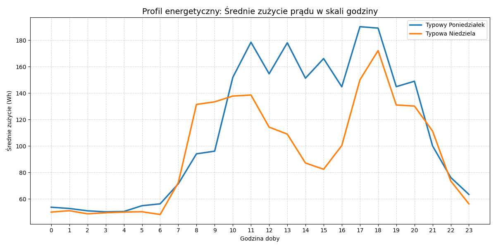
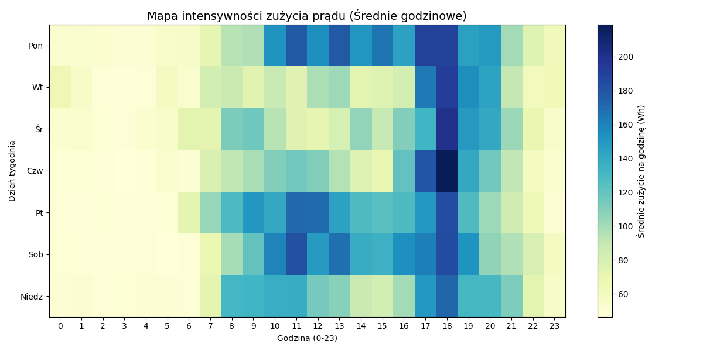
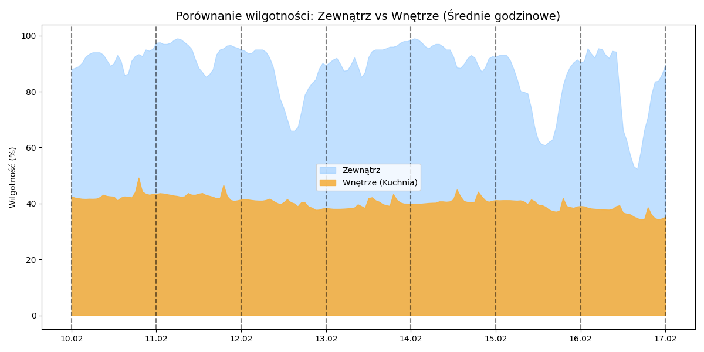
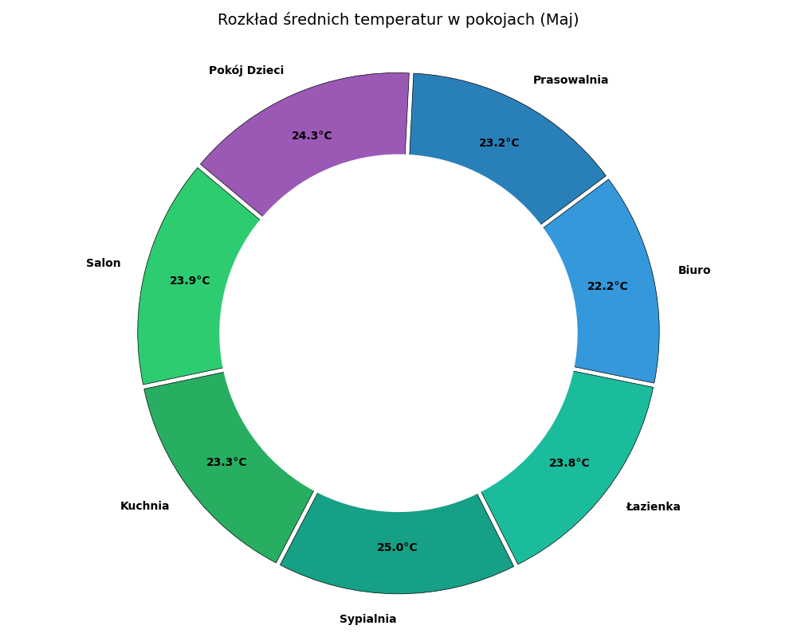
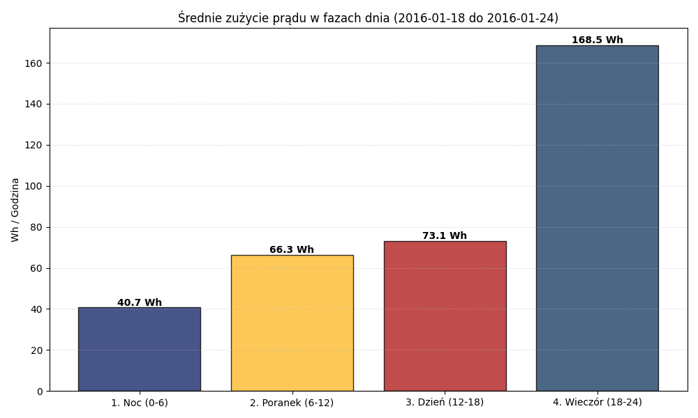

# Sprawozdanie: Analiza danych z domowego systemu IoT

**Autor:** Łukasz Kopeć (274410)
**Data:** 5 kwietnia 2026 r.  
**Przedmiot:** Inżynieria testów

---

## 1. Cel zadania 
Celem zadania było przygotowanie odpowiedniego kodu w języku Python oraz przeprowadzenie podstawowej analizy danych pochodzących z czujników systemu Smart Home (IoT).

## 2. Przygotowanie środowiska i danych
Przed przystąpieniem do generowania wykresów przygotowałem odpowiednie zaplecze techniczne:
* Skonfigurowałem środowisko wirtualne (**venv**) i zainstalowałem niezbędne biblioteki: `pandas`, `matplotlib` oraz `numpy`.
* **Metodologia obróbki danych:** Surowe dane z czujników są zapisywane co 10 minut, co generuje dużo tzw. szumu pomiarowego (chwilowe skoki). Aby uzyskać rzetelny obraz trendów i nawyków domowników, **wszystkie dane przed analizą zostały uśrednione do pełnych godzin**. Dzięki temu wykresy są bardziej czytelne i pokazują realne procesy zachodzące w budynku.

---

## 3. Analiza danych systemu Smart Home IoT

### 3.1. Zadanie 1: Profil stylu życia (Poniedziałek vs Niedziela)

**Opis i analiza:**
Wykres porównuje średnie zużycie energii w typowy dzień roboczy (poniedziałek) oraz w niedzielę. Pozwala to sprawdzić, jak zmienia się rytm dobowy mieszkańców w zależności od dnia tygodnia.

**Główne obserwacje:**
* **Zużycie bazowe (00:00 – 06:00):** W obie noce poziom zużycia jest stały i wynosi ok. 50 Wh. Jest to stałe obciążenie urządzeń, które muszą pracować zawsze (lodówka, routery).
* **Poranek:** W poniedziałek zużycie prądu rośnie gwałtownie już o **6:00 rano**, kiedy domownicy szykują się do wyjścia. W niedzielę ten moment jest przesunięty o ponad godzinę.
* **Aktywność w ciągu dnia:** W poniedziałki między 10:00 a 16:00 zużycie jest wyższe niż w niedzielę, co może sugerować działanie urządzeń AGD pod nieobecność domowników (np. zaprogramowane pranie).
* **Szczyt wieczorny:** Najwięcej prądu dom pobiera po godzinie **17:00**, szczególnie w poniedziałki. Jest to czas powrotów, przygotowywania posiłków i korzystania z multimediów.

**Wnioski:** Największy potencjał do optymalizacji kosztów energii występuje wieczorem, gdy zużycie jest najwyższe. Wyraźna różnica w godzinach porannych między dniem roboczym a wolnym sugeruje, że systemy automatyki (np. ogrzewanie) można by zaprogramować tak, aby w weekendy startowały później, co przyniosłoby dodatkowe oszczędności.

### 3.2. Zadanie 2: Mapa ciepła: Intensywność zużycia prądu w tygodniu

**Opis i analiza:**
Mapa ciepła wizualizuje, kiedy dom najbardziej obciąża sieć w skali całego tygodnia. Ciemniejszy kolor oznacza wyższe, uśrednione zużycie energii w danej godzinie.

**Główne obserwacje:**
* **Cisza nocna:** Jasny pas w godzinach nocnych (23:00 - 06:00) potwierdza minimalne zużycie prądu niezależnie od dnia tygodnia.
* **Popołudniowe szczyty:** W dni robocze (szczególnie wtorek-czwartek) widać wyraźne ciemne pola w godzinach **16:00 - 19:00**. Są to momenty szczytowego poboru prądu w skali tygodnia.
* **Równomierne weekendy:** W soboty i niedziele zużycie jest bardziej rozłożone na cały dzień, co wynika z ciągłej obecności mieszkańców w domu.

**Wnioski:** Mapa dowodzi, że obciążenie domowej sieci nie jest równe w skali całego tygodnia. Skumulowanie prac domowych w środku tygodnia sugeruje, że domownicy mogliby rozważyć przeniesienie części zadań wymagających użycia sprzętu AGD na weekend, kiedy pobór mocy jest bardziej stabilny i "rozmyty" w czasie, co zapobiega przeciążeniom instalacji w godzinach szczytu.

### 3.3. Zadanie 3: Wpływ warunków atmosferycznych na mikroklimat domu

**Opis i analiza:**
Wykres przedstawia zestawienie wilgotności zewnętrznej (niebieska) oraz wewnętrznej (pomarańczowa) na przestrzeni wybranego tygodnia.

**Główne obserwacje:**
* **Zmienna aura na zewnątrz:** Wilgotność za oknem jest bardzo niestabilna, gwałtownie rośnie w nocy i spada w ciągu dnia.
* **Stabilna "wyspa" wewnątrz:** Mimo drastycznych zmian na zewnątrz, wilgotność w kuchni utrzymuje się na prawie idealnie płaskim poziomie (ok. 40-42%).

**Wnioski:** Taki rozkład danych udowadnia, że budynek posiada doskonałą izolację, która skutecznie odcina wnętrze od wpływu pogody.

### 3.4. Zadanie 4: Porównanie średnich temperatur w domu (Maj)

**Opis i analiza:**
Wykres kołowy przedstawia rozkład średnich temperatur w różnych częściach domu w maju.

**Główne obserwacje:**
* **Zrównoważone ciepło:** Większość pomieszczeń mieszkalnych utrzymuje bardzo zbliżoną temperaturę w okolicach **21-22°C**.
* **Strefy cieplejsze:** Najwyższe średnie temperatury odnotowano w **Łazience oraz Kuchni**, co wynika z procesów bytowych (gotowanie, ciepła woda).

**Wnioski:** System ogrzewania i izolacja działają poprawnie, zapewniając równy komfort w całym budynku bez „zimnych punktów”.

### 3.5. Zadanie 5: Analiza zużycia energii w różnych porach dnia (Zima)

**Opis i analiza:**
Ostatnie zadanie to podział doby na cztery fazy (Noc, Poranek, Dzień, Wieczór) dla mroźnego tygodnia w styczniu.

**Główne obserwacje:**
* **Dominacja wieczoru:** Wieczór (18-24) to czas zdecydowanie największego obciążenia, ze średnim zużyciem przekraczającym **120 Wh**.
* **Tło nocne:** Noc to jedyny moment, gdy dom „odpoczywa”, a zużycie prądu spada do niezbędnego minimum.

**Wnioski:** Analiza potwierdza, że styl życia mieszkańców ma kluczowe znaczenie dla rachunków – największy potencjał do oszczędności przypada właśnie na godziny wieczorne.

